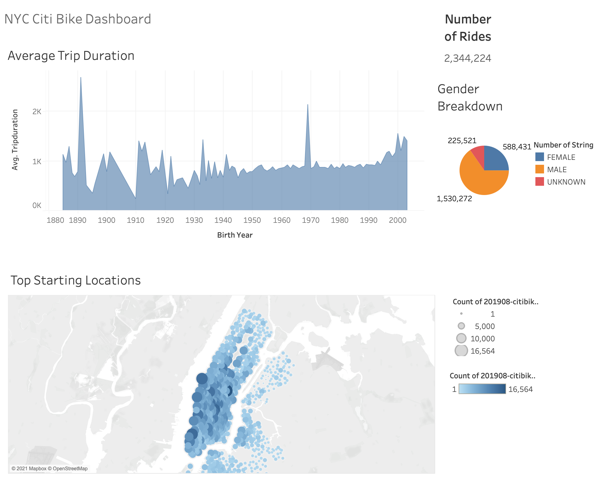
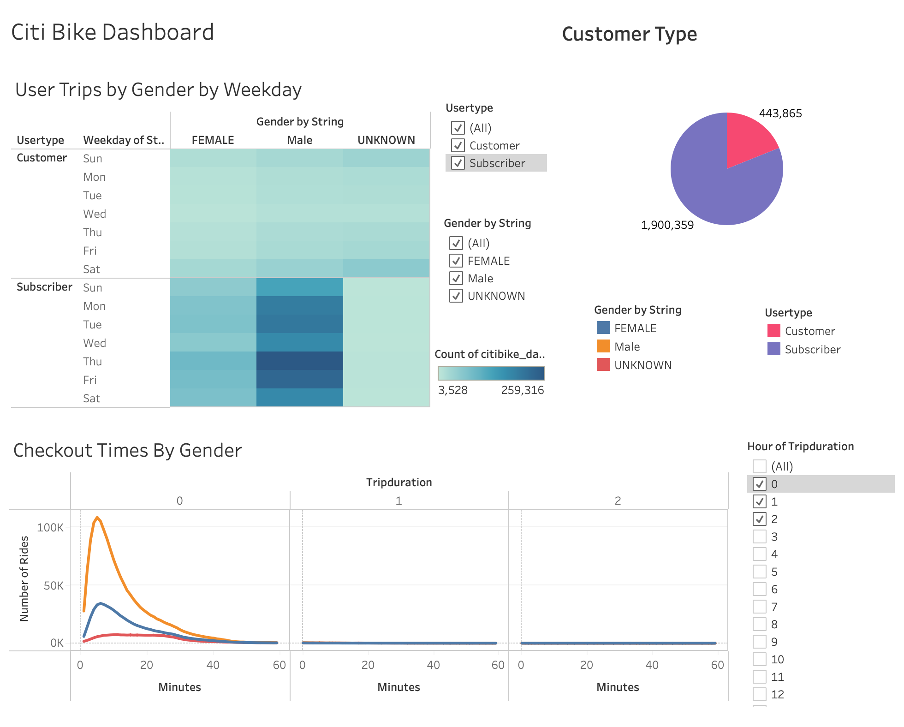

# Citi Bike 

## Overview
This project created an analysis for New York's Citi Bike program, using over 200,000 data points in the U.S. to generate business insights into the peak use of Citi Bikes in New York City in August.

## Data
* In this project, we use the August trip data as our data source.
* Click [here](https://s3.amazonaws.com/tripdata/index.html) for data.

## Result

* Click [here](https://public.tableau.com/views/CitiBike_challenge/CitiBikeStory?:language=en-US&:display_count=n&:origin=viz_share_link) for the complete Dashboard

## Summary
