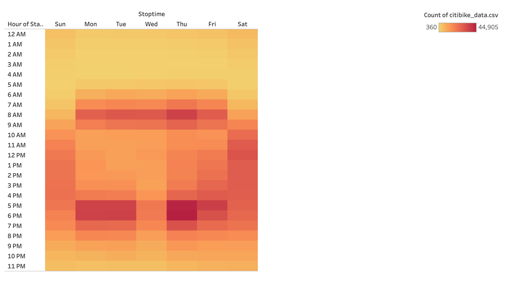

# Citi Bike 

## Overview
This project created an analysis for New York's Citi Bike program, using over 200,000 data points in the U.S. to generate business insights into the peak use of Citi Bikes in New York City in August.

## Data
* In this project, we use the August trip data as our data source.
* Click [here](https://s3.amazonaws.com/tripdata/index.html) for data.

## Result

* There are total number of 2,344,224 trips in Augus.
* There are 588,431 female user and 1,530,272 male user of Citi Bikes.
* In general, the younger the rider, the longer the average riding trip duration.
* The most popular start location are within the Manhattan.

* There are two type of users: one time customer and anual subscriber. The number of subscriber way greater than one time customer.
* In general, male user ride more than female user. And Citi Bike user ride more in Weekdays compare to Weekends.
* The Citi Bike users normally ride the bike for less than 2 hours.

* Click [here](https://public.tableau.com/views/CitiBike_challenge/CitiBikeStory?:language=en-US&:display_count=n&:origin=viz_share_link) for the complete Dashboard

* In Weekdays, the peak hour using Citi Bike are 7-9am and 5-7pm.
* In Weekends, rider using Citi Bike between 10am to 7pm.

## Summary
In conclusion, there are more male user using Citi Bike to comute in New York City. In weekdays, the peak hour using Citi Bike are 7-9am and 5-7pm. While in weekends, user prefer rideing Citi Bike between 10am-7pm. However, there is limitation in this analysis. From the gender pie chart, there is 225,521 user with unknown gender which might impact our analysis.
